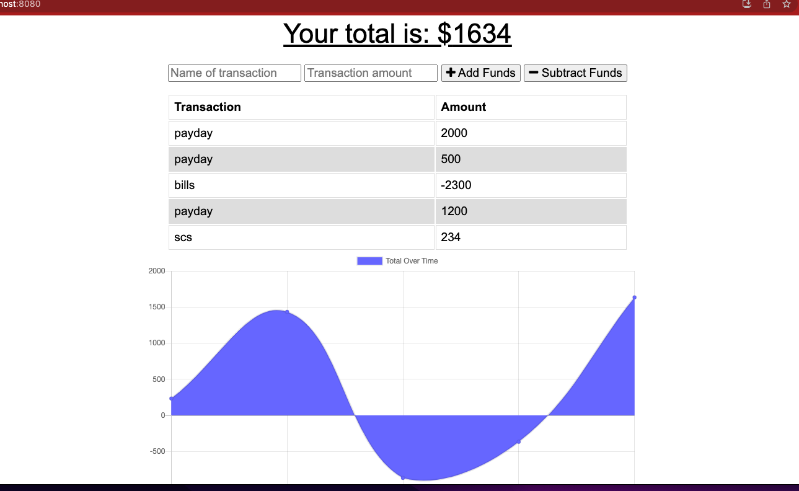

# PWA-john

## Table Of Contents

- [Description](#Discription)
- [Installation](#Installation)
- [Usage](#Usage)
- [License](#License)
- [Contributing](#Contributing)
- [Questions](#Question)

## Description

I managed to get the app top work, due to alot of the code was in the oast modules. I had to just tweak the code a bit to try and fit this challange. I had it a major issue with deploying my app. i think it had something to do with the webpack, because I had been just trying to get the code to work for the cache and trying to firgure out the offline feature. However I manged to get it to work locally so I am proud of that.

## Image

## Video Link

https://drive.google.com/file/d/1gHqXVn6JY2H35fQyXDcli4v06LIvQZD8/view

## License

## Contributing

John Enriquez Perez

## Question

Github account: [juanjohn11](https://github.com/juanjohn11)

Email me: Johnenriquez1144@gmail.com
